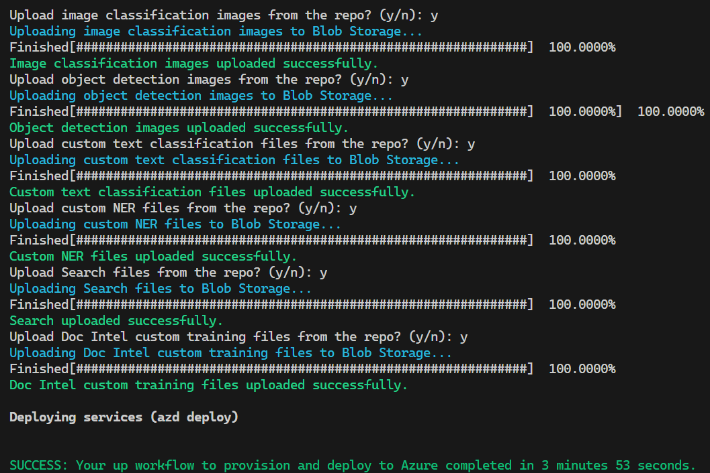

  
  
  

# My AI-102 Demos
If you would like to run any of the demos from this repo, you can use the Azure Developer CLI (`azd`) to provision the infrastructure.  
Note: Although several demos are web apps, web apps aren't currently deployed as part of the `azd` deployment. There's something to be said for demonstrating that you can leverage AI capabilities from anywhere, even running on your own machine!  

The demos in this repository are intended to be modular and deployed to separate resource groups. This keeps things more organised and makes it easier to show resources for specific demos, rather than having many resources in a resource group that aren't relevant to what you're demonstrating. Having said that, there's nothing stopping you from cloning this repository and making whatever changes suit you 😊

## AZD
Make sure you execute **all** `azd` commands from within the `azd` folder.  
Using `azd` allows you to set up an environment with multiple resources and resource groups when required, including having scripts execute before and after the provisioning of resources, then tear down the environment and remove relevant soft-deleted resources in the process. You can then rinse and repeat!

## Prerequisites
- Ensure you already have the Azure Developer CLI installed (you can use `winget install Microsoft.Azd -s winget`) first.
- After installing the Azure Developer CLI, authenticate using `azd auth login`.
- You must also have PowerShell Core / PowerShell 7 (pwsh) installed before running the `azd up` command.
- Ensure you already have the Azure CLI installed.

## Provisioning
- Deployment should be done using the `azd` CLI and not using the VS Code extension because the extension often fails to execute required scripts.
- To begin, simply run the `azd up` command (I've seen required scripts not always running when you use the `provision` command, so stick with `up`).
    - You will be prompted for an environment name, followed by your subscription and region (for the deployment itself, not for the specific resource deployments).
    - A pre-provision script will prompt you for any required information/values. This is designed so you can select all of the demos or only specific demos you'd like to provision the infrastructure for.
    - Upon completion, a post-provision script will ask you if you'd like it to automatically upload certain files for the demos you've deployed. For those you select `y`, it will proceed to upload the relevant files to the correct containers.
    - After completion, all the important outputs (endpoints and keys etc.) can be found in the deployment properties within Azure, or within the `.azure\<environment-name>\.env` file for you to view/copy as required.

    
    

## Deleting
- You can use the `azd down` command to delete everything deployed to the relevant environment (it uses the `azd-env-name` tag to determine this).
- If you'd like to delete everything deployed to the environment, not be prompted for confirmation, and purge anything that gets soft-deleted, you can use the `azd down --force --purge` command.
- All Azure OpenAI deployments for Azure OpenAI resources in the relevant resource group will be deleted automatically before the `azd down` action is performed.
- All Azure Machine Learning Workspaces and dependent resources associated with the workspace will be deleted and purged before the `azd down` action is performed.
